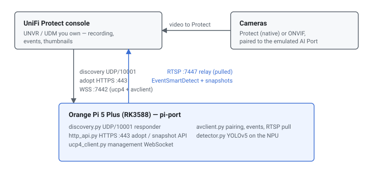

# Pi Port — a DIY UniFi Protect "AI Port" on an Orange Pi (RK3588)

<div align="center">

<a href="LICENSE"></a>
<a href="https://github.com/hutchx86/pi-port/actions/workflows/ci.yml"></a>

**A reverse-engineering / interoperability proof of concept that makes a stock
Orange Pi 5 Plus (RK3588) present itself to a real UniFi Protect console as
genuine AI Port hardware (catalog model `UVC AI Port`, sysid `0xa5f1`) —
discovery, adoption, camera pairing, video relay, NPU object detection, and
detection events with thumbnails.**

It talks the vendor wire protocol only: no firmware modification, no controller
database writes, no Ubiquiti code or binaries.

</div>

> [!WARNING]
> Proof of concept, not production software. It binds privileged ports
> (UDP/10001, TCP/443) and manages macvlan interfaces and DHCP leases;
> misconfiguration can disrupt your network or device. Use it only on hardware
> and consoles you own. See [Disclaimer](#disclaimer).

> [!NOTE]
> Not affiliated with, endorsed by, or connected to Ubiquiti Inc. "UniFi",
> "UniFi Protect" and "AI Port" are trademarks of Ubiquiti Inc. No Ubiquiti
> firmware or binaries are distributed here. Built with AI assistance under
> human review — verify anything you rely on. See [Legal](#legal).

## Quick start

```bash
git clone https://github.com/hutchx86/pi-port && cd pi-port
sudo scripts/install.sh --console <console-ip> [--parent-iface <iface>]
# then adopt "AI Port" in Protect and pair a camera to it
```

## At a glance

|  |  |
| --- | --- |
| **What** | Emulates the UniFi Protect AI Port device role on an RK3588 board |
| **Hardware** | Orange Pi 5 Plus (RK3588) |
| **Protocol / interface** | UBNT discovery UDP/10001; mTLS WSS :7442 (`ucp4` + classic avclient); RTSP relay :7447 |
| **Language** | Python 3 |
| **Status** | Working against a real Protect console — 4 cameras paired and streamed concurrently |
| **License** | AGPL-3.0-or-later |

## How it compares

|  | Real AI Port | Pi Port |
| --- | --- | --- |
| **What it is** | Ubiquiti AI Port appliance (Ambarella) | This repo's Python, on an Orange Pi 5 Plus (RK3588) |
| **Firmware** | Ubiquiti, signed | None — the emulator itself |
| **Detection model** | Ubiquiti's own classifier | Stock YOLOv5 (person/vehicle/animal), RKNN on the NPU |
| **Output** | Full Ubiquiti product behaviour | The subset this project implements |

It is a protocol-compatible stand-in built on the same shared camera/chime
middleware, not a clone of the device.

## How it works

The board answers the console's L2 discovery, then adopts like a classic camera
(`POST /api/1.2/manage` on HTTPS :443). It keeps two mTLS WebSocket connections
to the console — the generic `ucp4` channel for management RPCs, and the classic
avclient channel for camera pairing and detection events. When a camera is
paired, the console hands the board an RTSP URL on its own internal relay
(`:7447`); the board pulls that stream, runs YOLOv5 on the NPU, and pushes
`EventSmartDetect` events and snapshot uploads back to the console.



| Component | Language | Role |
| --- | --- | --- |
| `discovery.py` | Python | UDP/10001 UBNT discovery responder |
| `http_api.py` | Python | HTTPS :443 adopt / control / snapshot API |
| `ucp4_client.py` | Python | Generic `ucp4` device-management WebSocket |
| `avclient.py` | Python | Pairing, streaming and smart-detect WebSocket + detection loop |
| `detector.py` | Python | YOLOv5 inference wrapper (RKNN / NPU) |
| `sysinfo_server.py` | Python | Dev-box CPU/mem/GPU/NPU status page (`webui.html`) |
| `instance_manager.py`, `run_all.py` | Python | Multi-instance orchestration |

## Supported hardware

| Model | SoC / variant | Status | Notes |
| --- | --- | --- | --- |
| Orange Pi 5 Plus | RK3588 | Verified | The target board; 4 real cameras paired and streamed concurrently |
| Other RK3588 boards | RK3588 | Untested | Should work; the NPU and ffmpeg paths are RK3588-specific |

## Features

- **Emulated AI Port device role** — L2 discovery, adoption, and both WebSocket
  connections a real console expects.
- **Camera pairing and video relay** — pairs real cameras and pulls their stream
  from Protect's internal RTSP relay.
- **Real NPU object detection** — YOLOv5 → RKNN on the RK3588 NPU
  (person/vehicle/animal), not a placeholder.
- **Detection events with thumbnails** — `EventSmartDetect` with per-object
  snapshots and Full-FoV images, plus the overview/timeline thumbnails.
- **Multi-instance** — one reboot-surviving systemd unit and macvlan interface
  per instance, each a distinct L2 device, with a small web UI.
- **Honest state handling** — reflects real adopted state and clears local state
  on the console's reset.

## Requirements

- Orange Pi 5 Plus (or another RK3588 board) running Linux, with root — the
  emulator binds UDP/10001 and TCP/443.
- Python 3, and `rknn-toolkit-lite2` on the board for NPU inference.
- A UniFi Protect console you own and control, on the same LAN.
- For model conversion: an x86_64 Linux host with `rknn-toolkit2` (the RKNN
  converter does not run on the board).

## Repository layout

```
piport/            the emulator (RK3588 / Orange Pi)
  discovery.py       UDP/10001 UBNT discovery responder
  http_api.py        HTTPS :443 adopt/control API
  ucp4_client.py     generic ucp4 device-management websocket
  avclient.py        pairing/streaming/smart-detect websocket + detection
  detector.py        YOLOv5 inference wrapper (RKNN / NPU)
  sysinfo_server.py  dev-box CPU/mem/GPU/NPU status page (+ webui.html)
  models/            anchors + COCO labels (model binaries fetched, not stored)
  instance_manager.py / run_all.py  multi-instance orchestration
scripts/           install.sh (one-shot installer), fetch_models.py, helpers
rknn_convert/      YOLOv5s -> RKNN conversion recipe (x86 build host)
docs/images/       README diagram
```

Model binaries (`.onnx`/`.rknn`) and all Ubiquiti firmware are **not** stored
here; see [Model assets](#model-assets-not-tracked). `piport/README.md` has the
protocol detail and per-component notes. The x86/no-NPU Docker variant lives on
the `experimental` branch.

## Install / Usage

`scripts/install.sh` does the whole stand-up on the board: system packages, a
venv + dependencies, model assets, the required `librknnrt.so` upgrade, a
reboot-surviving systemd instance (via `instance_manager.py`), and the web UI.

```bash
sudo scripts/install.sh --console <UNVR-IP> [--parent-iface <iface>]
```

- Run from the checkout root, as root. `--parent-iface` defaults to the
  auto-detected default-route NIC.
- The NPU model cannot be built on the Pi; build it on an x86 host
  (`scripts/fetch_models.py --convert`) or let the installer fetch it from
  `--rknn-url` / `PIPORT_RKNN_URL` / its default URL. `--rknn <path>` takes a
  local build, and a local `models-rknn/` submodule is also detected. Use
  `--no-npu` for a CPU-only protocol-stack install.
- Opens the web UI on `:8090` (`--webui-port` to change) for board stats and
  instance management.

Then, in Protect:

1. Adopt "AI Port" from the console UI like any camera.
2. Pair a real camera to it from the camera's own settings page.
3. Detections appear as dashboard events with thumbnails, and the console's own
   person/vehicle/animal filters work.

`run_all.py` needs root (binds UDP/10001 and TCP/443) and must be able to send L2
broadcast/multicast on the LAN, so run it on the host, not in a NAT'd container.
It resolves its own interface's IP by default, so multiple instances on one box
don't collide on `:443`.

### Manual install

The installer automates the steps below; run them by hand if you prefer:

```bash
# 1. Fetch the model assets into models/ (downloads ONNX + labels;
#    --convert also builds the .rknn on an x86 box with rknn-toolkit2).
python3 scripts/fetch_models.py
python3 scripts/fetch_models.py --convert     # optional, x86 build host

# 2. Install runtime dependencies.
pip install -r piport/requirements.txt
pip install rknn-toolkit-lite2

# 3. Set device identity and your console IP.
$EDITOR piport/aiport.cfg

# 4. Run (needs root).
sudo python3 piport/run_all.py --iface <your-iface>
```

### Single instance (systemd)

A minimal unit for reboot survival:

```ini
[Unit]
Description=UniFi AI Port emulator
After=network-online.target
Wants=network-online.target

[Service]
Type=simple
WorkingDirectory=/opt/pi-port/piport
ExecStart=/usr/bin/python3 /opt/pi-port/piport/run_all.py --iface <iface>
Restart=on-failure
KillMode=control-group
[Install]
WantedBy=multi-user.target
```

`KillMode=control-group` matters: `run_all.py` spawns four child processes and
only reaps them on `KeyboardInterrupt`, so a plain SIGTERM would orphan them.

### Multiple instances

`instance_manager.py` creates one systemd unit per instance, each with its own
macvlan sub-interface, MAC, and DHCP lease — a distinct L2 device, so the console
sees independent AI Ports:

```bash
sudo python3 piport/instance_manager.py create lab2 --parent-iface <iface>
python3 piport/instance_manager.py list
sudo python3 piport/instance_manager.py destroy lab2
```

Identity (MAC/device-id) is generated once at creation and baked into the unit,
so it is stable across reboots. `create --ip X.Y.Z.W` uses a static address
instead of DHCP. The web UI (`sysinfo_server.py`) can also create/destroy
instances.

### x86 / Docker variant

The x86/no-NPU Docker variant is not part of `main`; it is maintained on the
`experimental` branch (`piport/x86/`, onnxruntime on CPU):

```bash
git switch experimental
```

### Model assets (not tracked)

The detector needs an open YOLOv5 model. Because the binaries are large and
reproducible, they are not committed; `scripts/fetch_models.py` downloads them:

| Asset | Used by | Source |
| --- | --- | --- |
| `yolov5s_relu.onnx` (27.6 MiB) | RKNN conversion (`.rknn`) | Rockchip model zoo delivery: <https://ftrg.zbox.filez.com/v2/delivery/data/95f00b0fc900458ba134f8b180b3f7a1/examples/yolov5/yolov5s_relu.onnx> |
| anchors, COCO labels, bus.jpg, calibration subset | RKNN conversion | <https://github.com/airockchip/rknn_model_zoo> (tag `v2.3.2`) |

The experimental x86 variant additionally uses Ultralytics `yolov5n.onnx`
(AGPL-3.0, same as the weights) and still accepts the Rockchip
`yolov5s_relu.onnx` via `AIPORT_MODEL_PATH` (both output layouts are
auto-detected); see that branch's README.

`yolov5s_relu.rknn` is produced on an x86_64 machine with `rknn-toolkit2`
(install from PyPI or the Rockchip GitHub release — see `rknn_convert/convert.py`
and `piport/README.md`):

```bash
python3 scripts/fetch_models.py --convert
```

`scripts/install.sh` resolves the prebuilt `.rknn` in this order: `--rknn
<path>`, a local copy at `models-rknn/` (e.g. a git submodule of a separate
model repo) or `rknn_convert/`, then a download from `--rknn-url` /
`PIPORT_RKNN_URL` / its `DEFAULT_RKNN_URL`. It verifies the pinned sha256 where
one applies (always for the default URL). The default source is the separate
AGPL-3.0 model repo
[`hutchx86/pi-port-models`](https://github.com/hutchx86/pi-port-models) (tag
`v1`); the model is never committed to this repo.

**Model license.** The model derives from Ultralytics YOLOv5 (AGPL-3.0) via
Rockchip's model zoo (Apache-2.0), so any redistributed `.rknn` is an AGPL-3.0
work, the same license as this project. If you redistribute it, include the
AGPL-3.0 text and attribution; the corresponding source is this repo's
conversion recipe plus the ONNX in the table above. Check those licenses
yourself before redistributing.

## Configuration

Device identity, network mode and the console address live in
`piport/aiport.cfg`; CLI flags on each script override it.

| Key | Default | Meaning |
| --- | --- | --- |
| `[identity] mac` | derived | Device MAC (12 hex chars). Blank derives one from the interface's OUI |
| `[identity] platform` | `UVC AI Port` | Catalog model string the console matches (must be exact) |
| `[identity] sysid` | `0xa5f1` | Hardware/model id |
| `[identity] device_id` | per-instance | Persistent device UUID (must be unique per instance) |
| `[network] iface` / `mode` / `ip` | auto / `dhcp` / — | Interface to bind, and `dhcp` or `static` addressing |
| `[console] host` / `port` | — / `7442` | The Protect console to dial when not yet adopted |

## Verification

- Unit suite (no hardware required):

  ```bash
  cd piport && python3 -m unittest discover -s tests
  ```

- On-device: run the stack on the Orange Pi and watch it discover, adopt and pair
  (see `piport/README.md` and `scripts/live_watch.py`).

## Roadmap / known limitations

- **Known:** detection is stock YOLOv5 (person/vehicle/animal) on the RK3588 NPU,
  not Ubiquiti's classifier; face recognition, license-plate recognition and
  vehicle classification are not implemented.
- **Known:** the x86/no-NPU Docker variant is maintained on the `experimental`
  branch and is not verified on real hardware.
- **Planned:** stress-testing multiple cameras beyond the four-camera live setup.

## Troubleshooting

<details>
<summary><b>Troubleshooting / operational notes</b></summary>

**A partial restart leaves stale connections.** Restart the full four-process
stack (beacon/discovery, adopt HTTP, ucp4, avclient) — a partial restart leaves
untouched connections in stale state. `run_all.py` starts all four together.

**`pkill -f 'run_all.py'` kills itself.** The pattern matches the killing command
line. Use the bracket trick and also kill orphaned ffmpeg children:

```bash
pkill -9 -f '[r]un_all.py'
pkill -9 -f '[f]fmpeg.*rtsp://<console-ip>:7447'
```

**Starting detached over SSH hangs.** A backgrounded `nohup` can hold the SSH
channel open; use `setsid -f <command> >log 2>&1 </dev/null`.

**Multiple instances collide on `:443`.** Bind each instance to its own
interface's real IP (the default) rather than `0.0.0.0` — a wildcard bind claims
the port on every address on the box.

</details>

## Credits

Special thanks to
[dciancu/unifi-protect-unvr-docker-arm64](https://github.com/dciancu/unifi-protect-unvr-docker-arm64)
— the inspiration for getting into UniFi tinkering in general, and whose methods
helped in learning how parts of it work.

Protocol work was informed by the open-source UniFi community; the detection
model and conversion recipe come from Rockchip's model zoo. Third-party
components and their licenses are listed in [CREDITS.md](CREDITS.md).

<details>
<summary><b>Legal</b></summary>

- **Not affiliated with, or endorsed by, Ubiquiti Inc.** "UniFi", "UniFi
  Protect" and "AI Port" are trademarks of Ubiquiti Inc.
- **No Ubiquiti firmware or binaries are distributed here.** You supply your own
  console, cameras and (for reverse engineering) firmware images.
- Intended for interoperability and personal use on hardware and consoles you
  own. Reverse-engineering may be restricted in your jurisdiction, and you are
  responsible for how you use this. Nothing here targets third-party systems.

</details>

<details>
<summary><b>Disclaimer</b></summary>

**This is a proof-of-concept project, not a production-ready system.** Large
parts were produced with LLMs (Claude Code and DeepSeek) under human supervision,
review, and real-hardware testing — review and verify everything yourself.
**This software is provided "as is", without warranty of any kind.** It binds
privileged ports, manipulates network interfaces (macvlan/DHCP), and runs
detection hardware; misconfiguration can disrupt your network or device. By using
it you accept full responsibility for any damage, data loss, or other
consequences. **The authors and contributors are not responsible or liable for
any loss or damage arising from its use.**

</details>

## Security

Report vulnerabilities privately via GitHub Security Advisories. Runtime state —
the adoption token and the mTLS client certificate/key — is written to the
instance state directory (`--state-dir`) and excluded by `.gitignore`; never
commit it. No secrets are stored in this repository.

## License

AGPL-3.0-or-later. See [LICENSE](LICENSE). Because this is a network service,
anyone who runs a modified version for others to interact with over a network
must offer them the corresponding source.
